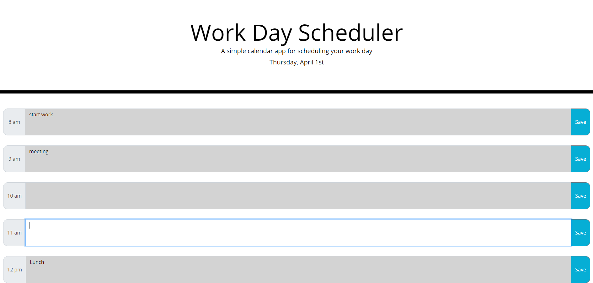

# Work-Day-Scheduler

## Description:

Scheduler that uses moment.js, jquery, and bootstrap to allow a user to plan out their work day.

## Screenshoot of website:

## Link to live website:

[Work Day Scheduler.](https://richardthopkins.github.io/Work-Day-Scheduler/)